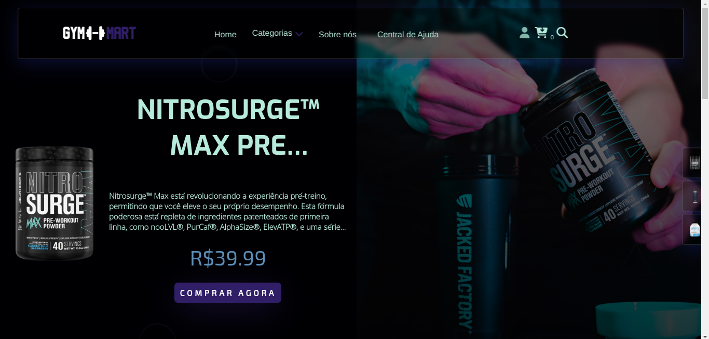

# Gym Mart

> Bem-vindo à Gym Mart, o seu destino premium para tudo relacionado ao universo fitness! Na nossa loja online, você encontrará uma ampla gama de produtos cuidadosamente selecionados para atender às suas necessidades de treino e condicionamento físico. Desde potentes suplementos para ganho de massa e perda de gordura até pré-treinos energéticos que impulsionarão seus exercícios, temos tudo o que você precisa para alcançar seus objetivos fitness.

> Explore nossas categorias especializadas, como "Ganho de Massa" e "Acessórios", para descobrir produtos de alta qualidade que são essenciais para otimizar seu desempenho. Nosso compromisso é oferecer não apenas produtos, mas também uma experiência de compra excepcional, garantindo que você tenha acesso aos melhores itens do mercado.

  
Sumário

  <ol>
    <li><a href="#preview">Preview</a></li>
    <li><a href="#correções">Correções</a></li>
    <li><a href="#como-experimentar-o-projeto">Como experimentar o projeto</a></li>
  </ol>

## Preview

  

&nbsp;

## Correções

- [x] Banner carrossel
- [x] Formulário de cadastro funcional
- [ ] Carrinho funcional
- [ ] Formulário de login funcional

&nbsp;

## Como experimentar o projeto?

- Passo 1: Clone este repositório em sua máquina: `https://github.com/ArthurMiguel53/GymMart.git`
- Passo 2: Instale as dependências necessárias com o comando `npm install`
- Passo 3: Inicie o servidor local: `npm start serve`
- Divirta-se! :)

&nbsp;

  <a href="#gym-mart">⬆ Voltar ao topo</a> 

